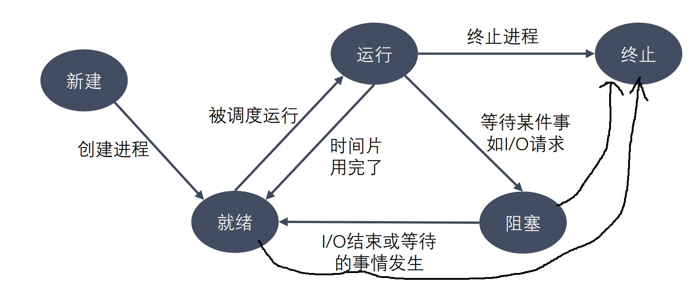
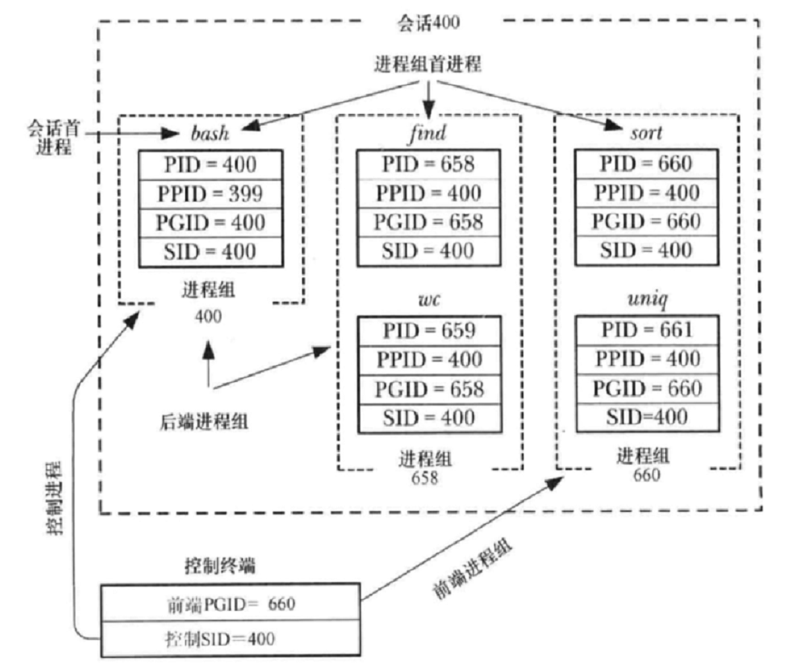

### 程序
程序是包含一系列信息的文件，这些信息描述了如何在运行时创建一个进程：
* 二进制格式标识：每个程序文件都包含用于描述可执行文件格式的元信息。内核利用此信息来解释文件中的其他信息。（ELF可执行连接格式）
* 机器语言指令：对程序算法进行编码。
* 程序入口地址：标识程序开始执行时的起始指令位置。
* 数据：程序文件包含的变量初始值和程序使用的字面量值（比如字符串）。
* 符号表及重定位表：描述程序中函数和变量的位置及名称。这些表格有多重用途，其中包括调试和运行时的符号解析（动态链接）。
* 共享库和动态链接信息：程序文件所包含的一些字段，列出了程序运行时需要使用的共享库，以及加载共享库的动态连接器的路径名。
* 其他信息：程序文件还包含许多其他信息，用以描述如何创建进程。

### 进程
* 进程是正在运行的程序的实例。是一个具有一定独立功能的程序关于某个数据集合的一次运行活动。它是操作系统动态执行的基本单元。在传统的操作系统中，进程既是基本的分配单元，也是基本的执行单元。
* 可以用一个程序来创建多个进程，进程是由内核定义的抽象实体，并为该实体分配用以执行程序的各项系统资源。从内核的角度看，进程由用户内存空间和一系列内核数据结构组成，其中用户内存空间包含了程序代码及代码所使用的变量，而内核数据结构则用于维护进程状态信息。记录在内核数据结构中的信息包括许多与进程相关的标识号（IDs）、虚拟内存表、打开文件的描述符表、信号传递及处理的有关信息、进程资源使用及限制、当前工作目录和大量的其他信息

### PCB
* 为了管理进程，内核必须对每个进程所做的事情进行清楚的描述。内核为每个进程分配一个 PCB（Processing Control Block，进程控制块），维护进程相关的信息。Linux 内核的PCB是 task_struct 结构体。
* 在 /usr/src/linux-headers-xxx/include/linux/sched.h 文件中可以查看 task_struct 结构体定义。其内部成员有很多，我们只需要掌握以下部分即可：
    * 进程id：系统中每个进程有唯一的 id，用 pid_t 类型表示，其实就是一个非负整数。
    * 进程的状态：有就绪、运行、挂起、停止等状态。
    * 进程切换时需要保存和恢复的一些CPU寄存器。
    * 描述虚拟地址空间的信息。
    * 描述控制终端的信息。


            
不同的地方：
pcb中的一些数据
    当前的进程的id pid
    当前的进程的父进程的id ppid
    信号集

共同点：
某些状态下：子进程刚被创建出来，还没有执行任何的写数据的操作
    - 用户区的数据
    - 文件描述符表

父子进程对变量是不是共享的？
- 刚开始的时候，是一样的，共享的。如果修改了数据，不共享了。
- 读时共享（子进程被创建，两个进程没有做任何的写的操作），写时拷贝。


### 进程状态
进程状态反映进程执行过程的变化。这些状态随着进程的执行和外界条件的变化而转换。
* 运行态：进程占有处理器正在运行。
* 就绪态：进程具备运行条件，等待系统分配处理器以便运行。当进程已分配到除CPU以外的所有必要资源后，只要再获得CPU，便可立即执行。在一个系统中处于就绪状态的进程可能有多个，通常将它们排成一个队列，称为就绪队列。
* 阻塞态：又称为等待(wait)态或睡眠(sleep)态，指进程不具备运行条件，正在等待某个事件的完成。
* 新建态：进程刚被创建时的状态，尚未进入就绪队列。
* 终止态：进程完成任务到达正常结束点，或出现无法克服的错误而异常终止，或被操作系统及有终止权的进程所终止时所处的状态。进入终止态的进程以后不再执行，但依然保留在操作系统中等待善后。一旦其他进程完成了对终止态进程的信息抽取之后，操作系统将删除该进程。





### 进程回收
在每个进程退出的时候，内核释放该进程所有的资源、包括打开的文件、占用的内存等。但是仍然为其保留一定的信息，这些信息主要主要指进程控制块PCB的信息（包括进程号、退出状态、运行时间等）。
父进程可以通过调用wait或waitpid得到它的退出状态同时彻底清除掉这个进程。
* wait() 和 waitpid() 函数的功能一样，区别在于，wait() 函数会阻塞，
* waitpid() 可以设置不阻塞，waitpid() 还可以指定等待哪个子进程结束。
* 一次wait或waitpid调用只能清理一个子进程，清理多个子进程应使用循环

### 孤儿进程
父进程运行结束，但子进程还在运行，这样的子进程就称为孤儿进程
（Orphan Process）。
每当出现一个孤儿进程的时候，内核就把孤儿进程的父进程设置为 init，而 init 进程（Linux PID为1的进程）会循环地等待子进程退出。这样，当一个孤儿进程结束了其生命周期的时候，init 进程就会处理它的一切善后工作。因此孤儿进程并不会有什么危害。
但正常来说，父进程有回收子进程的义务。

### 僵尸进程
每个子进程结束之后, 都会释放自己地址空间中的用户区数据，并会向其父进程发送一个SIGCHLD信号。。但内核区的 PCB 没有办法自己释放掉，需要父进程去释放。
如果子进程终止时，父进程尚未回收子进程在内核的PCB，那么子进程就变成了变成僵尸（Zombie）进程。
僵尸进程不能被 kill -9 杀死，这样就会导致一个问题，如果父进程不调用 wait() 或 waitpid() 的话，那么保留的那段信息就不会释放，其进程号就会一直被占用，但是系统所能使用的进程号是有限的，如果大量的产生僵尸进程，将因为没有可用的进程号而导致系统不能产生新的进程，此即为僵尸进程的危害。

> 为什么要设置这个状态呢？
设置僵死状态的目的是维护子进程的信息，以便父进程在以后某个时候获取。这些信息至少包括进程ID，进程的终止状态，以及该进程使用的CPU时间，所以当终止子进程的父进程调用wait或waitpid时就可以得到这些信息。

> 如果父进程不管儿子的话？
如果一个进程终止，而该进程有子进程处于僵尸状态，那么它的所有僵尸子进程的父进程ID将被重置为1（init进程）。继承这些子进程的init进程将清理它们（也就是说init进程将wait它们，从而去除它们的僵尸状态）。

 


### 进程相关命令
```bash
# 查看所有线程
ps aux
# top实时显示进程动态
```

### 杀死进程
```bash
kill [-signal] pid
kill –SIGKILL pid  # -9也行，因为SIGKILL就是9的宏
kill –l  # 列出所有信号
```

### 进程号
每个进程都由进程号来标识，其类型为 pid_t（整型），进程号的范围：0～32767（2^15-1，有符号INT16最大值）。
进程号总是唯一的，但可以重用。当一个进程终止后，其进程号就可以再次使用。
* 任何进程（除 init 进程）都是由另一个进程创建，该进程称为被创建进程的父进程，对应的进程号称为父进程号（PPID）。
* 进程组是一个或多个进程的集合。他们之间相互关联，进程组可以接收同一终端的各种信号，关联的进程有一个进程组号（PGID）。默认情况下，当前的进程号会当做当前的进程组号。


### 调试
GDB 默认只能跟踪一个进程，可以在 fork 函数调用之前，通
过指令设置 GDB 调试工具跟踪父进程或者是跟踪子进程，默认跟踪父进程。
设置调试父进程或者子进程：set follow-fork-mode [parent（默认）| child]
设置调试模式：set detach-on-fork [on | off]
默认为 on，表示调试当前进程的时候，其它的进程继续运行，如果为 off，调试当前进程的时候，其它进程被 GDB 挂起。（停在fork()处）
查看调试的进程：info inferiors
切换当前调试的进程：inferior id
使进程脱离 GDB 调试：detach inferiors id（自己就直接跑完了）


### 终端
在 UNIX 系统中，用户通过终端登录系统后得到一个 shell 进程，这个终端成为 shell 进程的控制终端。

进程中，控制终端是保存在 PCB 中的信息，而 fork() 会复制 PCB 中的信息，因此由 shell 进程启动的其它进程的控制终端也是这个终端。

默认情况下（没有重定向），每个进程的标准输入、标准输出和标准错误输出都指向控制终端，进程从标准输入读也就是读用户的键盘输入，进程往标准输出或标准错误输出写也就是输出到显示器上。

在控制终端输入一些特殊的控制键可以给前台进程发信号，例如 Ctrl + C 会产生 SIGINT 信号，Ctrl + \ 会产生 SIGQUIT 信号。


### 进程组
进行组由一个或多个共享同一进程组标识符（PGID）的进程组成。一个进程组拥有一个首进程，该进程是创建该组的进程，其进程 ID 为该进程组的 ID，新进程会继承其父进程所属的进程组 ID。

进程组拥有一个生命周期，其开始时间为首进程创建组的时刻，结束时间为最后一个成员进程退出组的时刻。一个进程可能会因为终止而退出进程组，也可能会因为加入了另外一个进程组而退出进程组。进程组首进程无需是最后一个离开进程组的成员。

### 会话

会话是一组进程组的集合。会话首进程是创建该新会话的进程，其进程 ID 会成为会话 ID。新进程会继承其父进程的会话 ID。

一个会话中的所有进程共享单个控制终端。控制终端会在会话首进程首次打开一个终端设备时被建立。一个终端最多可能会成为一个会话的控制终端。

在任一时刻，会话中的其中一个进程组会成为终端的前台进程组，其他进程组会成为后台进程组。只有前台进程组中的进程才能从控制终端中读取输入。当用户在控制终端中输入终端字符生成信号后，该信号会被发送到前台进程组中的所有成员。

当控制终端的连接建立起来之后，会话首进程会成为该终端的控制进程。

### 进程组、会话、控制终端之间的关系
进程组和会话在进程之间形成了一种两级层次关系：进程组是一组相关进程的集合，会话是一组相关进程组的集合。进程组和会话是为支持 shell 作业控制而定义的抽象概念，用户通过 shell 能够交互式地在前台或后台运行命令。

下面是两个shell语句的结果
```bash
find / 2 > /dev/null | wc -l &
sort < longlist | uniq -c
```



### 守护进程
守护进程（Daemon Process），也就是通常说的 Daemon 进程，是Linux 中的后台服务进程。它是一个生存期较长的进程，通常独立于控制终端并且周期性地执行某种任务或等待处理某些发生的事件。一般采用以 d 结尾的名字。

守护进程具备下列特征：
* 生命周期很长，守护进程会在系统启动的时候被创建并一直运行直至系统被关闭。
* 它在后台运行并且不拥有控制终端。没有控制终端确保了内核永远不会为守护进程自动生成任何控制信号以及终端相关的信号（如 SIGINT、SIGQUIT）。
* Linux 的大多数服务器就是用守护进程实现的。比如，Internet 服务器 inetd，Web 服务器 httpd 等。

创建步骤：
1. 执行一个 fork()，之后父进程退出，子进程继续执行。（因为父进程组ID就是父进程ID，在父进程创建会话导致在两个不同的会话出现两个相同的PID组长进程）
2. 子进程调用 setsid() 开启一个新会话。（这样就没有控制终端了）
3. 清除进程的 umask 以确保当守护进程创建文件和目录时拥有所需的权限。
4. 修改进程的当前工作目录，通常会改为根目录（/）。（如果是U盘，就无法卸载，所以设置更目录）
5. 关闭守护进程从其父进程继承而来的所有打开着的文件描述符。（虽然脱离控制终端，但还是存在终端，为了防止写入数据）
6. 在关闭了文件描述符0、1、2之后，守护进程通常会打开/dev/null，并使用dup2() 使所有这些描述符指向这个设备。
7. 核心业务逻辑

一般1，2，7是必要的。


每一个命令行终端都是一个 shell 进程，你在这个终端里执行的程序实际上都是这个 shell 进程分出来的子进程。正常情况下，shell 进程会阻塞，等待子进程退出才重新接收你输入的新的命令。加上&号，只是让 shell 进程不再阻塞，可以继续响应你的新命令。但是无论如何，你如果关掉了这个 shell 命令行端口，依附于它的所有子进程都会退出。

而(cmd &)这样运行命令，则是将cmd命令挂到一个systemd系统守护进程名下，认systemd做爸爸，这样当你退出当前终端时，对于刚才的cmd命令就完全没有影响了。
