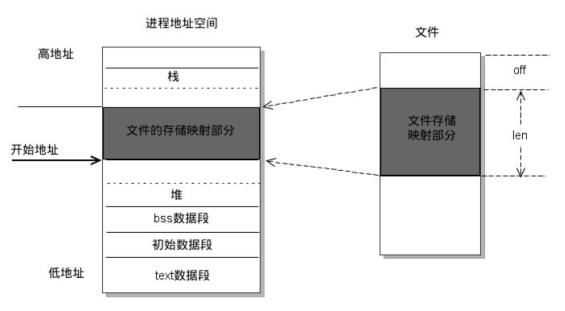

### IPC概念
进程是一个独立的资源分配单元，不同进程（这里所说的进程通常指的是用户进程）之间的资源是独立的，没有关联，不能在一个进程中**直接**访问另一个进程的资源。
但是，进程不是孤立的，不同的进程需要进行信息的交互和状态的传递等，因此需要进程间通信( IPC：Inter Processes Communication )：
* 数据传输：一个进程需要将它的数据发送给另一个进程。
* 通知事件：一个进程需要向另一个或一组进程发送消息，通知它（它们）发生了某种事件（如进程终止时要通知父进程）。
* 资源共享：多个进程之间共享同样的资源。为了做到这一点，需要内核提供互斥和同步机制。
* 进程控制：有些进程希望完全控制另一个进程的执行（如 Debug 进程），此时控制进程希望能够拦截另一个进程的所有陷入和异常，并能够及时知道它的状态改变

### Linux进程通信方式


# 管道
管道也叫匿名管道，它是是 UNIX 系统 IPC 的最古老形式，所有的 UNIX 系统都支持这种通信机制。

举个例子：统计一个目录中文件的数目命令：ls | wc –l
为了执行该命令，shell 创建了两个进程来分别执行 ls 和 wc。


管道其实是一个在内核内存中维护的缓冲器，这个缓冲器的存储能力是有限的，不同的操作系统大小不一定相同。

### 管道特点
* 管道拥有文件的特质：读操作、写操作，匿名管道没有文件实体，有名管道有文件实体，但不存储数据。可以按照操作文件的方式对管道进行操作。
* 一个管道是一个字节流，使用管道时不存在消息或者消息边界的概念，从管道读取数据的进程可以读取任意大小的数据块，而不管写入进程写入管道的数据块的大小是多少。
* 通过管道传递的数据是顺序的，从管道中读取出来的字节的顺序和它们被写入管道的顺序是完全一样的。
* 在管道中的数据的传递方向是单向的，一端用于写入，一端用于读取，管道是半双工的。
* 从管道读数据是一次性操作，数据一旦被读走，它就从管道中被抛弃，释放空间以便写更多的数据，在管道中无法使用 lseek() 来随机的访问数据。
* 匿名管道只能在具有公共祖先的进程（父进程与子进程，或者两个兄弟进程，具有亲缘关系）之间使用。

> 为什么管道可以在具有亲缘关系的进程进行通信？
最傻瓜的回答：因为它们的fd是共享的。

### 管道数据结构


### 使用方法
1. 进程在使用fork函数创建子进程前先创建一个管道，该管道用于在父子进程间通信，然后创建子进程，
2. 之后父进程关闭管道的读端，子进程关闭管道的写端。父进程负责向管道写数据而子进程负责读数据。


### 管道的读写特点
管道默认是阻塞的：如果管道中没有数据，read阻塞，如果管道满了，write阻塞。

一些异常情况：
* 读端问题
    * 写端被全部关闭（管道写端引用计数为0），且管道中无数据，读端read返回0（相当于读到文件的末尾）。
    * 写端没有完全关闭，读端read阻塞等待。
* 写端问题
    * 读端被全部关闭（管道读端引用计数为0），写端write会导致进程异常终止（进程收到SIGPIPE信号）。
    * 读端没有完全关闭，且管道已满，写端write阻塞。

### shell
```bash
# 查看管道缓冲大小命令
ulimit –a
```


### 有名管道
匿名管道只能用于亲缘关系的进程间通信。有名管道（FIFO），也叫命名管道提供了一个路径名与之关联，以 FIFO 的文件形式存在于文件系统中，并且其打开方式与打开一个普通文件是一样的，这样
即使与 FIFO 的创建进程不存在亲缘关系的进程，只要可以访问该路径，就能够彼此通过 FIFO 相互通信，
与管道一样，FIFO 也有一个写入端和读取端，并且从管道中读取数据的顺序与写入的顺序是一样的（先入先出）。
```bash
mkfifo
```

### 有名管道和匿名管道的区别
* FIFO 在文件系统中作为一个特殊文件存在（路径名），但 FIFO 中的内容却存放在内存中。
* 当使用 FIFO 的进程退出后，FIFO 文件将继续保存在文件系统中以便以后使用。
* FIFO 有名字，不相关的进程可以通过打开有名管道进行通信。

### 有名管道的一般用法
1. 一个为只读而打开一个管道的进程会阻塞，直到另外一个进程为只写打开管道。
2. 一个为只写而打开一个管道的进程会阻塞，直到另外一个进程为只读打开管道。

其他与匿名管道全部一致。


# 内存映射
内存映射（Memory-mapped I/O）是将磁盘文件的数据映射到内存，用户通过修改内存就能修改磁盘文件。

使用内存映射实现进程间通信：
* 有关系的进程
    1. 通过父进程，先创建内存映射区
    2. 有了内存映射区以后，创建子进程
    3. 父子进程共享创建的内存映射区
* 没有关系的进程间通信
    1. 准备一个大小不是0的磁盘文件
    2. 进程1通过磁盘文件创建内存映射区，得到一个操作这块内存的指针
    3. 进程2一样的操作。
    4. 使用内存映射区通信

注意：内存映射区通信，是非阻塞。

### 一些问题
* 如果对mmap的返回值ptr做++操作, munmap是否能够成功?

显然不行，要保留原始的地址。

* mmap后关闭文件描述符，对mmap映射有没有影响？
    
映射区还存在，创建映射区的fd被关闭，没有任何影响。

* 对ptr越界操作会怎样？

越界操作操作的是非法的内存，即段错误。

# 信号
信号是 Linux 进程间通信的最古老的方式之一，是事件发生时对进程的通知机制，有时也称之为软件中断，它是在软件层次上对中断机制的一种模拟，是一种异步通信的方式。

信号可以导致一个正在运行的进程被另一个正在运行的异步进程中断，转而处理某一个突发事件。

发往进程的诸多信号，通常都是源于内核。引发内核为进程产生信号的各类事件如下：
* 对于前台进程，用户可以通过输入特殊的终端字符来给它发送信号。比如输入 Ctrl+C 通常会给进程发送一个中断信号。
* 硬件发生异常，即硬件检测到一个错误条件并通知内核，随即再由内核发送相应信号给相关进程。比如执行一条异常的机器语言指令，诸如被 0 除，或者引用了无法访问的内存区域。
* 系统状态变化，比如 alarm 定时器到期将引起 SIGALRM 信号，进程执行的 CPU 时间超限，或者该进程的某个子进程退出。
* 运行 kill 命令或调用 kill 函数。

使用信号的两个主要目的是：
* 让进程知道已经发生了一个特定的事情。
* 强迫进程执行它自己代码中的信号处理程序。

信号的特点：
* 简单
* 不能携带大量信息
* 满足某个特定条件才发送
* 优先级比较高

查看系统定义的信号列表：kill –l 
前 31 个信号为常规信号，其余为实时信号。非实时即不可靠，不支持排队，可能造成信号丢失。

| 编号 | 信号名称 | 对应事件 | 默认动作 |
| :-: | :-: | :-: | :-: |
| 1 | SIGHUP | 用户退出shell时，由该shell启动的所有进程将 收到这个信号 | 终止进程 |
| 2 | SIGINT | 当用户按下了<Ctrl+C>组合键时，用户终端向正在运行中的由该终端启动的程序发出此信号 | 终止进程 |
| 3 | SIGQUIT | 用户按下<Ctrl+\>组合键时产生该信号，用户终端向正在运行中的由该终端启动的程序发出些信号 | 终止进程 |
| 4 | SIGILL | CPU检测到某进程执行了非法指令 | 终止进程并产生core文件 |
| 5 | SIGTRAP | 该信号由断点指令或其他 | trap指令产生 终止进程并产生core文件 |
| 6 | SIGABRT | 调用abort函数时产生该信号 | 终止进程并产生core文件 |
| 7 | SIGBUS | 非法访问内存地址，包括内存对齐出错 | 终止进程并产生core文件 |
| 8 | SIGFPE | 在发生致命的运算错误时发出。不仅包括浮点运算错误，还包括溢出及除数为0等所有的算法错误 | 终止进程并产生core文件 |
| 9 | SIGKILL | 无条件终止进程。该信号不能被忽略，处理和阻塞 | 杀死正常的进程（僵尸不算） |
| 10 | SIGUSE1 | 用户定义的信号。即程序员可以在程序中定义并使用该信号 | 终止进程 |
| 11 | SIGSEGV | 指示进程进行了无效内存访问(段错误) | 终止进程并产生core文件 |
| 12 | SIGUSR2 | 另外一个用户自定义信号，程序员可以在程序中定义并使用该信号 | 终止进程 |
| 13 | SIGPIPE | Broken pipe向一个没有读端的管道写数据 | 终止进程 |
| 14 | SIGALRM | 定时器超时，超时的时间 由系统调用alarm设置 | 终止进程 |
| 15 | SIGTERM | 程序结束信号，与SIGKILL不同的是，该信号可以被阻塞和终止。通常用来要示程序正常退出。执行shell命令Kill时，缺省产生这个信号 | 终止进程
| 16 | SIGSTKFLT | Linux早期版本出现的信号，现仍保留向后兼容 | 终止进程 |
| 17 | SIGCHLD | 子进程结束时，父进程会收到这个信号 | 忽略这个信号 |
| 18 | SIGCONT | 如果进程已停止，则使其继续运行 | 继续/忽略 |
| 19 | SIGSTOP | 停止进程的执行。信号不能被忽略，处理和阻塞 | 终止进程 |
| 20 | SIGTSTP | 停止终端交互进程的运行。按下<ctrl+z>组合键时发出这个信号 | 暂停进程 |
| 21 | SIGTTIN |后台进程读终端控制台 | 暂停进程 |
| 22 | SIGTTOU | 类似于SIGTTIN，在后台进程要向终端输出数据时发生 | 暂停进程 |
| 23 | SIGURG | 套接字上有紧急数据时，向当前正在运行的进程发出些信号，报告有紧急数据到达。如网络带外数据到达 | 忽略该信号 |
| 24 | SIGXCPU | 进程执行时间超过了分配给该进程的CPU时间，系统产生该信号并发送给该进程 | 终止进程 |
| 25 | SIGXFSZ | 超过文件的最大长度设置 | 终止进程 |
| 26 | SIGVTALRM | 虚拟时钟超时时产生该信号。类似于SIGALRM，但是该信号只计算该进程占用CPU的使用时间 | 终止进程 |
| 27 | SGIPROF | 类似于SIGVTALRM，它不公包括该进程占用CPU时间还包括执行系统调用时间 | 终止进程 |
| 28 | SIGWINCH | 窗口变化大小时发出 | 忽略该信号 |
| 29 | SIGIO | 此信号向进程指示发出了一个异步IO事件 | 忽略该信号 |
| 30 | SIGPWR | 关机 | 终止进程 |
| 31 | SIGSYS | 无效的系统调用 | 终止进程并产生core文件 |
|34~64 | SIGRTMIN~SIGRTMAX | LINUX的实时信号，它们没有固定的含义（可以由用户自定义） | 终止进程 |


查看信号的详细信息：man 7 signal

## 比较值得注意的信号
* SIGSTOP：不能被捕捉，不能被忽略。病毒常用。
* SIGKILL：SIGSTOP的功能外，还可以杀死除了init以外的所有进程
* SIGPIPE：当服务器close一个连接时，若client端接着发数据。根据TCP 协议的规定，会收到一个RST响应，client再往这个服务器发送数据时（第二次写），系统会发出一个SIGPIPE信号给进程，告诉客户端进程这个连接已经断开了，不要再写了，client退出。
若不想客户端退出可以在sa_handler把SIGPIPE设为SIG_IGN。

http://senlinzhan.github.io/2017/03/02/sigpipe/


SIGKILL可以杀死除了init以外的所有进程

### SIGCHLD信号
产生条件
* 子进程终止时
* 子进程接收到 SIGSTOP 信号停止时
* 子进程处在停止态，接受到SIGCONT后唤醒时

以上三种条件都会给父进程发送 SIGCHLD 信号，父进程默认会忽略该信号。所以一般可以使用SIGCHLD信号解决僵尸进程的问题。

### 信号默认处理动作
* Term：终止进程
* Ign：当前进程忽略掉这个信号
* Core：终止进程，并生成一个Core文件
* Stop：暂停当前进程
* Cont：继续执行当前被暂停的进程

sa_handler有SIG_DFL这个选项。直接使用SIG_DFL有点粗暴，内核会直接丢掉这个信号，一个比较完备的就是写一个空的回调。


### 信号状态
* 产生：比如用户通过键盘 Ctrl + C，产生SIGINT。
* 未决（Pending）：信号产生但是没有被处理的状态。在内核中将这些信号存储在未决信号集中。比如SIGINT信号状态被存储在第二个标志位上
    * 这个标志位的值为0，说明信号不是未决状态
    * 这个标志位的值为1，说明信号处于未决状态
* 阻塞：是一个开关动作，指的是阻止信号被处理，但不是阻止信号产生。这是让系统暂时保留信号留待以后发送。由于另外有办法让系统忽略信号，所以一般情况下信号的阻塞只是暂时的，只是为了防止信号打断敏感的操作。
* 递达（Delivery）：执行信号的处理

信号产生，没有得到处理，未决状态1

如果这个信号被阻塞了，就会一直得不到处理，未决状态一直为1

被处理了，未决状态就为0

可以推断，信号没有产生时，未决状态也为0

### 信号集
许多信号相关的系统调用都需要能表示一组不同的信号，多个信号可使用一个称之为信号集的数据结构来表示，其系统数据类型为 sigset_t。
在 PCB 中有两个非常重要的信号集。一个称之为“阻塞信号集”，另一个称之为“未决信号集”。这两个信号集都是内核使用位图机制来实现的。但操作系统不允许我们直接对这两个信号集进行位操作。而需自定义另外一个集合，借助信号集操作函数来对 PCB 中的这两个信号集进行修改。
未决状态的信号，需要被处理，处理之前需要和阻塞信号集（阻塞信号集默认不阻塞任何的信号）进行比较，如果没有阻塞，这个信号就被处理；如果阻塞了，这个信号就继续处于未决状态，直到阻塞解除，这个信号就被处理。


### 内核对信号的处理机制
1. 子进程终止产生信号SIGCHLD（用户态）
2. 内核中未决信号集的第17位会置1，并等待父进程拥有cpu权限再去执行捕获信号处理函数，（内核态）
3. 父进程执行捕获信号处理函数（用户态）；
4. 在去处理的瞬间，内核的17号位就会由1变为0，代表该信号有去处理了。（内核态）
5. 处理完，返回产生信号时的代码原位置。（用户态）

一共存在四次用户态与内核态之间的切换


# 共享内存
顾名思义，共享内存就是允许两个不相关的进程访问同一个逻辑内存。共享内存是在两个正在运行的进程之间共享和传递数据的一种非常有效的方式。不同进程之间共享的内存通常安排为同一段物理内存（通常被称为段）。进程可以将同一段共享内存连接到它们自己的地址空间中，所有进程都可以访问共享内存中的地址，就好像它们是由用C语言函数malloc分配的内存一样。而如果某个进程向共享内存写入数据，所做的改动将立即影响到可以访问同一段共享内存的任何其他进程。

由于一个共享内存段是一个进程用户空间的一部分，因此它无需内核介入。

与管道等要求发送进程将数据从用户空间的缓冲区复制进内核内存和接收进程将数据从内核内存复制进用户空间的缓冲区的做法相比，这种 IPC 技术的速度更快。


### 共享内存流程
1. 调用 shmget() 创建一个新共享内存段或取得一个既有共享内存段的标识符（即由其他进程创建的共享内存段）。这个调用将返回后续调用中需要用到的共享内存标识符。
2. 使用 shmat() 来附上共享内存段，即使该段成为调用进程的虚拟内存的一部分。
3. 此刻在程序中可以像对待其他可用内存那样对待这个共享内存段。为引用这块共享内存，程序需要使用由 shmat() 调用返回的 addr 值，它是一个指向进程的虚拟地址空间中该共享内存段的起点的指针。
4. 调用 shmdt() 来分离共享内存段。在这个调用之后，进程就无法再引用这块共享内存了。这一步是可选的，并且在进程终止时会自动完成这一步。
5. 调用 shmctl() 来删除共享内存段。只有当当前所有附加内存段的进程都与之分离之后内存段才会销毁。只有一个进程需要执行这一步

### 常见问题
1. 操作系统如何知道一块共享内存被多少个进程关联？

共享内存维护了一个结构体struct shmid_ds 这个结构体中有一个成员 shm_nattch，它记录了关联的进程个数。

2. 可不可以对共享内存进行多次删除？

可以，因为shmctl只是标记删除共享内存（共享内存的key为0），不是直接删除。

3. 什么时候真正删除呢?

当和共享内存关联的进程数为0的时候，就真正被删除

4. 共享内存和内存映射的区别
    1. 共享内存可以直接创建，内存映射需要磁盘文件（匿名映射除外）
    2. 所有的进程操作的是同一块共享内存；内存映射是每个进程在自己的虚拟地址空间中有一个独立的内存。
    3. 进程突然退出：共享内存还存在；内存映射区消失。运行进程的电脑死机，宕机了：数据存在在共享内存中，没有了；内存映射区的数据 ，由于磁盘文件中的数据还在，所以内存映射区的数据还存在。
    4. 进程退出：共享内存还在，标记删除（ 如果一个进程退出，会自动和共享内存进行取消关联，直到所有的关联的进程数为0才删除）；而内存映射区销毁。
           

### 缺点
共享内存并未提供同步机制。


### ipcs 用法
```bash
ipcs -a # 打印当前系统中所有的进程间通信方式的信息
ipcs -m # 打印出使用共享内存进行进程间通信的信息
ipcs -q # 打印出使用消息队列进行进程间通信的信息
ipcs -s # 打印出使用信号进行进程间通信的信
```